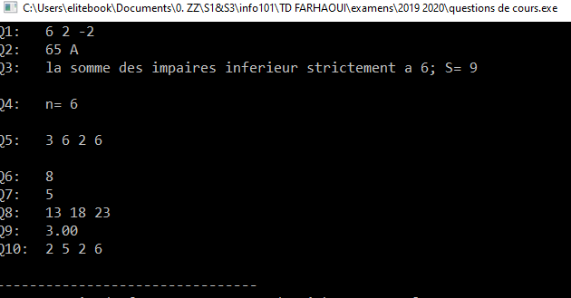
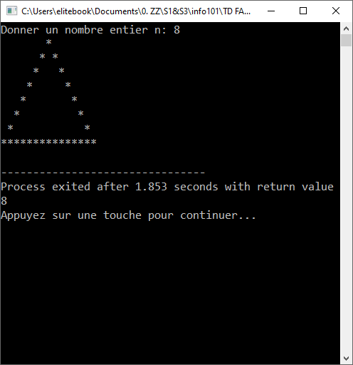

```c
#include<stdio.h>
main(){
	
	// Q1
	printf("Q1:   ");
	{
		int i=10 ; while (i>0) { i=i-4 ; printf("%d ",i) ; }
	}
	// Q2
	printf("\nQ2:   ");
	{
		char a ; a=65 ; printf("%d %c",a,a) ;
	}
	// Q3
	printf("\nQ3:   la somme des impaires inferieur strictement a 6; ");
	{
		int i ; int S=0 ;for (i=1 ; i<6;i+=2) S+=i;
		printf("S= %d\n", S);
	}
	// Q4
	printf("\nQ4:   ");
	{
		int a = 5, b = 9, c = 1,n; 
		n = a <b ? a <c ?c ?c : c-1 : !a ? a-1 : a+1 : 1;
		printf("n= %d\n", n);
	/* 
	if(a <b){
		if(a <c) 
			if(c) 
				n = c;
			else 
				n = c-1;
		else
		   if(!a) 
		   		n = a-1;
		   else
				n = a+1;
	}else{
		n  = 1;
	}
	*/
	
	}
	
	// Q5
	printf("\nQ5:   ");
	{
		int i = 3, j = 5; 
		printf("%d %d ", i-- , ++j) ; 
		printf("%d %d \n", i , j) ;
	}
	
	// Q6
	printf("\nQ6:   ");
	{
		int i,a ; 
		for(i=-1,a=0 ; i < 4 ; i++);

		a += 2*i ; printf ("%d",a);
	}
	
	// Q7
	printf("\nQ7:   ");
	{   // booleen 0: Faux  , 1, 2, (!= 0): Vrai
		int a,b, c = 3; 
		a = c++ ; // a = c; puis c = c +1; =>  a = 3, c = 4
		b = ++c;  // c = c + 1; puis b = c;  =>  b = 5, c = 5
		if(a = b) // a = b; a = 5
			printf ("%d", a); 
		else 
			printf ("%d",3*a);
	}
	
	// Q8
	printf("\nQ8:   ");
	{
		int i; 
		for(i=0; i<20 ;i++){
			switch(i){ 
				case 0: 
					i += 3; // => i =  3
				case 1: 
					i += 1; // => i =  4
				case 5: 
					i += 5; // => i =  9
				default: 
					i += 4; // => i =  13,  i = 18, i = 23
					break; 
			} 
			printf("%d ",i); 
		}
	}
	
	// Q9
	printf("\nQ9:   ");
	{
		int a = 13, b = 4; 
		float x; 
		x = (float)(a/b); 
		printf("%.2f",x);
	}
	
	// Q10 
	printf("\nQ10:  ");
	{
		int i = 3, j = 5; 
		printf("%d %d ", --i , j++) ; 
		printf("%d %d \n", i , j) ;
	}
}

```


```c
// Exercice 1
#include<stdio.h>
main(){
	int n, a, b, c;
	int estVamp; 
	
	for(n=100; n<=999; n++){
		estVamp = 0; // faux
		// 1)
		a = n;
		c = a % 10;   a = a / 10;
		b = a % 10;   a = a / 10;
		
		// 2)
		if(a*b == n || a*c == n || b*c == n)   
			estVamp = 1; // vrai
		else if(a*(b*10+c) == n || a*(c*10+b)== n)
			estVamp = 1; // vrai
		else if(b*(a*10+c) == n || b*(c*10+a)== n)
			estVamp = 1; // vrai
		else if(c*(b*10+a) == n || c*(a*10+b)== n)
			estVamp = 1; // vrai
		
		if(estVamp == 1)
			printf("%d est un nombre Vampire.\n", n);	
	}
}
```

```c
//Exercice 2
#include <stdio.h>

main (){
    int somPositif = 0, somNegatif = 0;
    int n;
    
    do{
        printf("Donner un nombre entier: ");
        scanf("%d", &n);
        
        if(n > 0)
        	somPositif += n; // somPositif = somPositif  + 1;
        else
        	somNegatif += n;
        	
        printf("*** positifs = %d negatif = %d total = %d ***\n", somPositif, somNegatif, somPositif + somNegatif);
    }while(somPositif + somNegatif != 0);
    

}


```

```c
// Exercice 3
#include <stdio.h>

main (){
	int i, j, espaceInterieur;
    int n;
    
    printf("Donner un nombre entier n: ");
    scanf("%d", &n);
    
    espaceInterieur = 1;
    for(i=1; i <= n; i++){ // pour la ligne i
    	// Afficher les espace antirieur
    	for(j=1; j <= n-i; j++) 
    		printf(" ");
    	
    	// Si la  premier ligne afficher une etoile *
    	if(i == 1)
    		printf("*");
    	else if(i != n){
    		// Sinon si vous entre 1  et n afficher les espace Interieur
    		// afficher une etoile * apres les espaces antirieur
    		printf("*");
    		for(j=1; j <= espaceInterieur; j++) 
    			printf(" ");
    		// afficher une etoile * a la fin
    		printf("*");
    		espaceInterieur += 2;
		}else{
			// Sinon si vous etes en dernier ligne, afficher des etoiles
			for(j=1; j <= n*2-1; j++) 
    			printf("*");
		}
	printf("\n");
	}
    
}


```


